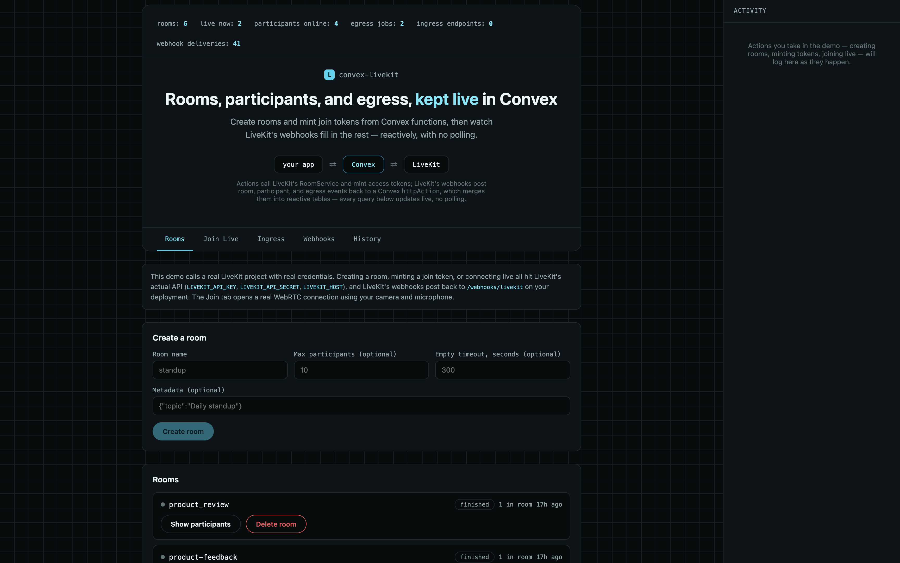

# convex-livekit

Sync LiveKit rooms, participants, tracks, and egress into your Convex
database reactively, and manage rooms, participants, and tracks directly
from Convex functions.

[](https://www.npmjs.com/package/convex-livekit)
[](https://www.convex.dev/components/sholajegede/convex-livekit)
[](https://www.npmjs.com/package/convex-livekit)
[](https://opensource.org/licenses/Apache-2.0)



```ts
const livekit = new LiveKit(components.convexLivekit, {
  apiKey: process.env.LIVEKIT_API_KEY!,
  apiSecret: process.env.LIVEKIT_API_SECRET!,
  host: process.env.LIVEKIT_HOST!,
});

const { sid, name } = await livekit.createRoom(ctx, { name: "standup" });
const { token } = await livekit.createRoomToken({
  roomName: name,
  identity: "user_123",
});

// Stays live from here — status, participants, tracks, and egress all
// update reactively as LiveKit's webhooks arrive.
const room = useQuery(api.example.getRoom, { name });
```

<!-- START: Include on https://convex.dev/components -->

## What this does

`convex-livekit` gives your Convex app a live, queryable view of LiveKit rooms,
the people in them, and their published tracks — kept up to date by LiveKit's
webhooks — plus a set of actions for managing rooms, participants, and
authenticating clients:

- **Reactive room & participant tracking** — `room_started`/`room_finished`,
  `participant_joined`/`participant_left`, and `participant_connection_aborted`
  (an unexpected disconnect, handled the same as a clean leave) update Convex
  rows, so `useQuery` in your React app re-renders as rooms open and people
  join or leave.
- **Track tracking** — `track_published`/`track_unpublished` sync each
  participant's tracks (source: camera, microphone, screen share; muted
  snapshot; type), so you can tell not just who's in a room but whether their
  mic or camera is actually live.
- **Egress tracking** — `egress_started`/`egress_updated`/`egress_ended` events
  are recorded too, so you can show recording/streaming status live.
- **Room, participant, and track management from your backend** — call
  `createRoom`, `deleteRoom`, `updateRoomMetadata`, `removeParticipant`,
  `updateParticipant`, and `mutePublishedTrack` from Convex actions, and mint
  room-join access tokens with `createRoomToken` for your clients to connect
  with.
- **Cryptographically verified webhooks** — every inbound webhook's signed JWT
  is verified (signature, issuer, expiry, and a body-hash check) before anything
  is written, matching LiveKit's own webhook verification scheme.

This is a [Convex component](https://convex.dev/components): its `rooms`,
`participants`, `tracks`, `egress`, and `webhookEvents` tables live in an
isolated schema, not your app's schema, and are only reachable through the
functions this component exposes.

## Table of Contents

- [convex-livekit](#convex-livekit)
  - [What this does](#what-this-does)
  - [Table of Contents](#table-of-contents)
  - [Install](#install)
  - [Quick Start](#quick-start)
    - [1. Add the component](#1-add-the-component)
    - [2. Set environment variables](#2-set-environment-variables)
    - [3. Mount the webhook handler](#3-mount-the-webhook-handler)
    - [4. Register the webhook in your LiveKit project](#4-register-the-webhook-in-your-livekit-project)
    - [5. Initialize the client](#5-initialize-the-client)
  - [Setup](#setup)
  - [Usage](#usage)
    - [Create a room](#create-a-room)
    - [Mint a join token for a client](#mint-a-join-token-for-a-client)
    - [Remove a participant](#remove-a-participant)
    - [Update a participant, or mute their track](#update-a-participant-or-mute-their-track)
    - [Read rooms, participants, and tracks reactively](#read-rooms-participants-and-tracks-reactively)
  - [Agent state](#agent-state)
  - [API Reference](#api-reference)
    - [Actions (need `ctx` from an action)](#actions-need-ctx-from-an-action)
    - [Plain methods (no `ctx` — touch no database)](#plain-methods-no-ctx--touch-no-database)
    - [Queries (work from actions, queries, or mutations)](#queries-work-from-actions-queries-or-mutations)
    - [Webhook](#webhook)
  - [Type Reference](#type-reference)
  - [Webhook Events](#webhook-events)
  - [Database Schema](#database-schema)
  - [Room Identity](#room-identity)
  - [Authentication](#authentication)
  - [Example App](#example-app)
  - [Testing](#testing)
  - [Limitations](#limitations)
  - [Troubleshooting](#troubleshooting)
  - [Contributing](#contributing)
  - [Changelog](#changelog)

## Install

```sh
npm install convex-livekit
```

## Quick Start

### 1. Add the component

```ts
// convex/convex.config.ts
import { defineApp } from "convex/server";
import convexLivekit from "convex-livekit/convex.config";

const app = defineApp();
app.use(convexLivekit);

export default app;
```

### 2. Set environment variables

```sh
npx convex env set LIVEKIT_API_KEY APIxxxxxxxx
npx convex env set LIVEKIT_API_SECRET your-api-secret
npx convex env set LIVEKIT_HOST https://your-project.livekit.cloud
```

These come from your LiveKit Cloud project settings (or your self-hosted
server's configured key/secret pair).

### 3. Mount the webhook handler

```ts
// convex/http.ts
import { httpRouter } from "convex/server";
import { components } from "./_generated/api";
import { LiveKit } from "convex-livekit";

const livekit = new LiveKit(components.convexLivekit, {
  apiKey: process.env.LIVEKIT_API_KEY!,
  apiSecret: process.env.LIVEKIT_API_SECRET!,
  host: process.env.LIVEKIT_HOST!,
});

const http = httpRouter();

http.route({
  path: "/webhooks/livekit",
  method: "POST",
  handler: livekit.webhookHandler,
});

export default http;
```

### 4. Register the webhook in your LiveKit project

In your LiveKit Cloud project settings (or your self-hosted server's `webhook`
config), set the webhook URL to
`https://<your-deployment>.convex.site/webhooks/livekit`. LiveKit signs every
webhook with your project's own API key/secret pair — there's no separate
webhook secret to configure.

### 5. Initialize the client

```ts
// convex/example.ts
import { action, query } from "./_generated/server";
import { components } from "./_generated/api";
import { LiveKit } from "convex-livekit";
import { v } from "convex/values";

const livekit = new LiveKit(components.convexLivekit, {
  apiKey: process.env.LIVEKIT_API_KEY!,
  apiSecret: process.env.LIVEKIT_API_SECRET!,
  host: process.env.LIVEKIT_HOST!,
});

export const listRooms = query({
  args: {},
  handler: async (ctx) => {
    return await livekit.listRooms(ctx, {});
  },
});
```

## Setup

The component needs no schema changes in your app — its tables (`rooms`,
`participants`, `tracks`, `egress`, `webhookEvents`) live entirely inside the
component's own isolated schema. All you need is the webhook mounted (step 3)
and a `LiveKit` client instance wherever you call its methods.

Unlike the other components in this series, `convex-livekit` never stores a
long-lived credential in a header — every server API call and every room-join
token is a fresh, short-lived JWT this component signs itself with your API
key/secret, following the same convention as LiveKit's own server SDKs.

## Usage

### Create a room

```ts
export const openRoom = action({
  args: { name: v.string(), maxParticipants: v.optional(v.number()) },
  handler: async (ctx, args) => {
    return await livekit.createRoom(ctx, args);
  },
});
```

Returns `{ sid, name }` and immediately records the room in Convex — you don't
have to wait for the `room_started` webhook to see it in a query.

### Mint a join token for a client

```ts
export const getJoinToken = action({
  args: { roomName: v.string(), identity: v.string() },
  handler: async (ctx, args) => {
    return await livekit.createRoomToken(args);
  },
});
```

`createRoomToken` touches no database — it's a plain signing operation, so it
also works from a query if you'd rather not spend an action round-trip. The
returned `{ token }` is what you pass to a LiveKit client SDK
(`room.connect(url, token)`).

### Remove a participant

```ts
export const kick = action({
  args: { roomName: v.string(), identity: v.string() },
  handler: async (ctx, args) => {
    await livekit.removeParticipant(ctx, args);
    return null;
  },
});
```

### Update a participant, or mute their track

```ts
export const setAgentState = action({
  args: { roomName: v.string(), identity: v.string(), state: v.string() },
  handler: async (ctx, args) => {
    await livekit.updateParticipant(ctx, {
      roomName: args.roomName,
      identity: args.identity,
      attributes: { "lk.agent.state": args.state },
    });
    return null;
  },
});

export const muteMic = action({
  args: { roomName: v.string(), identity: v.string(), trackSid: v.string() },
  handler: async (ctx, args) => {
    await livekit.mutePublishedTrack(ctx, { ...args, muted: true });
    return null;
  },
});
```

Both call LiveKit's server API first, then patch the corresponding Convex row
so the change is visible in queries immediately — no round trip through a
webhook required.

### Read rooms, participants, and tracks reactively

```tsx
const rooms = useQuery(api.example.listRooms, {});
const participants = useQuery(api.example.listParticipantsByRoom, {
  roomName: "standup",
});
const tracks = useQuery(api.example.listTracksByRoom, { roomName: "standup" });
```

Every `room_started`/`room_finished`,
`participant_joined`/`participant_left`/`participant_connection_aborted`, and
`track_published`/`track_unpublished` webhook event patches or inserts a row,
so these queries re-render live — no polling.

## Agent state

LiveKit Agents broadcasts what an agent is doing — listening, thinking,
speaking — through the participant's `attributes` map (conventionally under an
`lk.agent.state` key). `convex-livekit` reads that same field: it's synced into
`participants.attributes` on `participant_joined`/`left`/`connection_aborted`,
and you can also set it yourself with `updateParticipant`. That means a
Convex-backed UI can show live agent state with a plain `useQuery`, and your
backend can both read and drive it — for example, muting a user's microphone
track with `mutePublishedTrack` while an agent is mid-response, then unmuting
it for the user's turn. See the [Limitations](#limitations) section for what
this can and can't stay in sync with.

## API Reference

### Actions (need `ctx` from an action)

| Method                                                                                              | Description                                                                |
| ----------------------------------------------------------------------------------------------------| --------------------------------------------------------------------------|
| `createRoom(ctx, { name, emptyTimeout?, maxParticipants?, metadata? })`                              | Creates a room via the server API and records it. Returns `{ sid, name }`. |
| `deleteRoom(ctx, { name })`                                                                          | Deletes a room via the server API and marks it finished.                  |
| `updateRoomMetadata(ctx, { name, metadata })`                                                        | Updates a room's metadata via the server API and patches the stored row.  |
| `removeParticipant(ctx, { roomName, identity })`                                                     | Disconnects a participant via the server API and marks them left.         |
| `updateParticipant(ctx, { roomName, identity, metadata?, name?, attributes?, permission? })`         | Updates a participant's metadata, name, attributes, or permissions via the server API and patches the stored row. |
| `mutePublishedTrack(ctx, { roomName, identity, trackSid, muted })`                                   | Mutes or unmutes a participant's track via the server API and patches the stored row. |

### Plain methods (no `ctx` — touch no database)

| Method                                                                                                                | Description                                                                                                   |
| --------------------------------------------------------------------------------------------------------------------- | --------------------------------------------------------------------------------------------------------------|
| `createRoomToken({ roomName, identity, name?, canPublish?, canSubscribe?, canPublishData?, metadata?, ttlSeconds? })` | Signs and returns a room-join access token. Defaults to a 10-minute expiry and publish+subscribe permissions. |

### Queries (work from actions, queries, or mutations)

| Method                                                                | Description                                                                                                                       |
| ---------------------------------------------------------------------| ------------------------------------------------------------------------------------------------------------------------------------|
| `getRoom(ctx, { name })`                                              | Fetch one room by its name.                                                                                                       |
| `listRooms(ctx, { limit? })`                                          | Most recently updated rooms, newest first.                                                                                        |
| `listParticipantsByRoom(ctx, { roomName, limit? })`                   | Most recently updated participants for a room, newest first.                                                                      |
| `getEgress(ctx, { egressId })`                                        | Fetch one egress job by its id.                                                                                                   |
| `listEgressByRoom(ctx, { roomName, limit? })`                         | Most recently updated egress jobs for a room, newest first.                                                                       |
| `getTrack(ctx, { trackSid })`                                         | Fetch one track by its LiveKit track sid.                                                                                         |
| `listTracksByRoom(ctx, { roomName, limit? })`                         | Most recently updated tracks for a room, newest first.                                                                            |
| `listTracksByParticipant(ctx, { roomName, participantIdentity, limit? })` | Most recently updated tracks for one participant in a room, newest first.                                                     |
| `getStats(ctx)`                                                       | Counts: total rooms, currently-live rooms, currently-joined participants, egress jobs, total/currently-published tracks, and webhook deliveries. |
| `listRecentParticipants(ctx, { limit? })`                             | Most recently updated participants across every room, newest first.                                                               |
| `listRecentEgress(ctx, { limit? })`                                   | Most recently updated egress jobs across every room, newest first.                                                                |
| `listRecentWebhookEvents(ctx, { limit? })`                            | Most recently received webhook deliveries, newest first.                                                                          |

### Webhook

| Property         | Description                                                                                                                               |
| ---------------- | ----------------------------------------------------------------------------------------------------------------------------------------- |
| `webhookHandler` | An `httpAction` that verifies, deduplicates, and processes LiveKit's room, participant, track, and egress webhook events. Mount it at any route. |

## Type Reference

```ts
type LiveKitOptions = {
  apiKey: string;
  apiSecret: string;
  host: string; // e.g. "https://your-project.livekit.cloud"
};

type CreateRoomArgs = {
  name: string;
  emptyTimeout?: number; // seconds of emptiness before LiveKit closes the room
  maxParticipants?: number;
  metadata?: string;
};

type CreateRoomTokenArgs = {
  roomName: string;
  identity: string;
  name?: string; // participant display name
  canPublish?: boolean; // default true
  canSubscribe?: boolean; // default true
  canPublishData?: boolean; // default true
  metadata?: string;
  ttlSeconds?: number; // default 600 (10 minutes)
};

type UpdateParticipantArgs = {
  roomName: string;
  identity: string;
  metadata?: string;
  name?: string;
  attributes?: Record<string, string>; // LiveKit Agents uses this for agent state
  permission?: {
    canSubscribe?: boolean;
    canPublish?: boolean;
    canPublishData?: boolean;
    hidden?: boolean;
  };
};

type MutePublishedTrackArgs = {
  roomName: string;
  identity: string;
  trackSid: string;
  muted: boolean;
};

type Room = {
  name: string;
  sid?: string;
  status: "started" | "finished";
  numParticipants?: number;
  maxParticipants?: number;
  emptyTimeout?: number;
  metadata?: string;
  startedAt?: number;
  endedAt?: number;
  createdAt: number;
  updatedAt: number;
};

type Participant = {
  participantSid: string;
  roomName: string;
  identity: string;
  name?: string;
  state: "joined" | "left";
  metadata?: string;
  attributes?: Record<string, string>;
  joinedAt?: number;
  leftAt?: number;
  createdAt: number;
  updatedAt: number;
};

type Track = {
  trackSid: string;
  roomName: string;
  participantIdentity: string;
  type: string; // "audio" | "video" | "data"
  source: string; // "unknown" | "camera" | "microphone" | "screen_share" | "screen_share_audio"
  name?: string;
  muted: boolean;
  mimeType?: string;
  publishedAt?: number;
  unpublishedAt?: number;
  createdAt: number;
  updatedAt: number;
};

type Egress = {
  egressId: string;
  roomName?: string;
  status: string; // "EGRESS_STARTING" | "EGRESS_ACTIVE" | "EGRESS_ENDING" | "EGRESS_COMPLETE" | "EGRESS_FAILED" | "EGRESS_ABORTED"
  error?: string;
  startedAt?: number;
  endedAt?: number;
  createdAt: number;
  updatedAt: number;
};
```

## Webhook Events

The webhook handler processes eight of LiveKit's webhook event types (`ingress_*`
is accepted for idempotency but otherwise ignored — see Limitations):

- **`room_started`** / **`room_finished`** — upsert or finalize the room's row.
- **`participant_joined`** — upserts the participant's row (keyed by their
  `sid`, LiveKit's per-session participant id, distinct from `identity`),
  including their `attributes` map.
- **`participant_left`** / **`participant_connection_aborted`** — both mean the
  participant is gone (a clean leave vs. an unexpected disconnect) and are
  handled identically, marking the row `left`.
- **`track_published`** / **`track_unpublished`** — upsert or mark unpublished
  the track's row, keyed by its `sid`.
- **`egress_started`** / **`egress_updated`** / **`egress_ended`** — upsert the
  egress job's row.

Every request's `Authorization` header (a signed JWT, with or without a
`Bearer ` prefix — LiveKit's docs show it bare) is verified in full: its HS256
signature is recomputed with your `apiSecret` and compared, its `iss` claim must
match your `apiKey`, its `exp` claim must not be expired (with a 60-second
clock-skew allowance), and its `sha256` claim must match the SHA-256 digest of
the raw request body — this last check is what LiveKit's own `WebhookReceiver`
does, and it means a payload can't be replayed with a different body even if a
valid-looking token were somehow reused. Events are deduplicated by their own
`id` field, which LiveKit includes on every webhook delivery.

## Database Schema

```ts
rooms: {
  name: string;              // indexed: by_name
  sid?: string;
  status: "started" | "finished";
  numParticipants?: number;
  maxParticipants?: number;
  emptyTimeout?: number;
  metadata?: string;
  startedAt?: number;
  endedAt?: number;
  createdAt: number;
  updatedAt: number;
}

participants: {
  participantSid: string;    // indexed: by_participantSid
  roomName: string;          // indexed: by_roomName, and by_room_and_identity with identity
  identity: string;
  name?: string;
  state: "joined" | "left";
  metadata?: string;
  attributes?: Record<string, string>;
  joinedAt?: number;
  leftAt?: number;
  createdAt: number;
  updatedAt: number;
}

tracks: {
  trackSid: string;             // indexed: by_trackSid
  roomName: string;             // indexed: by_roomName, and by_participant with participantIdentity
  participantIdentity: string;
  type: string;                 // "audio" | "video" | "data"
  source: string;                // "unknown" | "camera" | "microphone" | "screen_share" | "screen_share_audio"
  name?: string;
  muted: boolean;
  mimeType?: string;
  publishedAt?: number;
  unpublishedAt?: number;
  createdAt: number;
  updatedAt: number;
}

egress: {
  egressId: string;          // indexed: by_egressId
  roomName?: string;         // indexed: by_roomName
  status: string;
  error?: string;
  startedAt?: number;
  endedAt?: number;
  createdAt: number;
  updatedAt: number;
}

webhookEvents: {
  eventId: string;   // indexed: by_eventId — LiveKit's own webhook event id
  eventType: string; // the `event` field, e.g. "room_started"
  payload: string;   // raw JSON body, for auditing/replay
  receivedAt: number;
}
```

This schema lives entirely inside the component's isolated namespace — it will
never collide with tables in your app's own `convex/schema.ts`.

## Room Identity

LiveKit rooms have both a `name` (the identifier your app chooses, and what
you'd pass to `createRoom`, `deleteRoom`, or a client's `room.connect()`) and a
`sid` (a unique id LiveKit assigns to that specific _session_ of the room — a
new one every time the room is recreated after being fully closed). This
component's `rooms` table is keyed by `name`, not `sid`: each row represents
"the current or most recent live session of this named room," with `sid` stored
as a field for reference. This matches how applications actually think about
rooms — you create a room called `"standup"` and reuse that name, rather than
tracking a new opaque id every time it reopens.

Participants, by contrast, are keyed by `participantSid` — a participant's own
per-session id — since the same `identity` (e.g. a user id) can legitimately
hold multiple simultaneous or sequential sessions across reconnects, and you
generally want each to show up as its own row. Tracks are keyed by their own
`trackSid`, which is unique per publish — republishing the same logical camera
or microphone gets a new row, and the old one stays as history with
`unpublishedAt` set.

## Authentication

Every write this component makes — creating a room, minting a join token — is a
freshly-signed HS256 JWT built from your `apiKey`/`apiSecret`, matching
LiveKit's own access-token format: an `iss` claim (your API key), `nbf`/`exp`
claims bounding its validity, and a `video` grant object describing what the
token is allowed to do (`roomCreate`/`roomAdmin` for server API calls,
`roomJoin` for tokens handed to clients). Server-API tokens this component signs
internally expire after 10 minutes; client join tokens default to the same but
accept a `ttlSeconds` override. There is no persistent server-side session —
every call is authenticated independently, the same way LiveKit's own
Node/Go/Python server SDKs work.

## Example App

`example/` is a small React app (`npm run dev`, then open `localhost:5173`) with
four tabs, plus a sidebar Activity log that records every action call as it
happens:

- **Rooms** — create a room (name, max participants, empty timeout, metadata),
  then expand any room to see its participants and their tracks live, mute a
  track, remove a participant, update the room's metadata, or delete the room
  outright.
- **Join Live** — mints a real join token with `createRoomToken` and opens an
  actual WebRTC connection with your camera and microphone, rendered with
  LiveKit's own
  [`@livekit/components-react`](https://www.npmjs.com/package/@livekit/components-react)
  `VideoConference` UI. This browser tab becomes a genuine participant — join it
  in two tabs to see both sides update reactively.
- **Webhooks** — every LiveKit webhook delivery this deployment has received,
  most recent first.
- **History** — recent rooms, participants, tracks, and egress jobs across every
  room, not just the one you're currently looking at.

To run it: set `LIVEKIT_API_KEY`/`LIVEKIT_API_SECRET`/`LIVEKIT_HOST` as Convex
environment variables (see [Setup](#setup)), add
`VITE_LIVEKIT_URL=wss://your-project.livekit.cloud` to the repo root's
`.env.local` for the Join Live tab, register the webhook (see
[Quick Start](#quick-start)), then run `npm run dev`.

## Testing

```sh
npm run test
npm run typecheck
```

Tests use [`convex-test`](https://www.npmjs.com/package/convex-test) at two
levels. `src/component/lib.test.ts` covers the component's mutations and
queries directly: room lifecycle transitions (confirming `markRoomFinished` and
`patchRoomMetadata` only touch their own fields), participant join/leave
tracking and attributes, track publish/unpublish/mute, the room
participant-count sync staying current without disturbing status or metadata,
egress upsert behavior, webhook idempotency via `checkAndRecordEvent`, and the
dashboard queries. `example/convex/http.test.ts` separately exercises the
actual `httpAction` end to end — signing requests with an independent HS256
implementation (not the component's own) to verify the handler rejects a
missing auth header, a wrong secret, a wrong issuer, an expired token, and a
tampered body, and correctly dispatches `participant_connection_aborted` and
the track events.

## Limitations

- `ingress_*` events are accepted (and recorded in `webhookEvents` for
  auditing) but not otherwise persisted — Ingress resource management
  (bringing external RTMP/WHIP streams into a room) is a distinct feature area
  from the server-side control plane this component covers.
- Track `muted` and participant `attributes` are snapshots, not continuously
  reactive: LiveKit has no webhook for a live mute toggle or an attributes
  change, so these fields are only refreshed at `track_published` /
  join-leave-abort time, and whenever this component's own
  `mutePublishedTrack` / `updateParticipant` calls succeed. A participant
  muting themselves client-side, or an agent changing its own attributes
  without going through `updateParticipant`, won't be reflected until the next
  event that does carry it.
- SIP is out of scope entirely — it's a different product surface
  (telephony), not an extension of the server-side control plane this
  component wraps.
- Only the `RoomService` methods needed for the common case (create, delete,
  update metadata, remove/update participant, mute a track) are wrapped;
  multi-room operations (`moveParticipant`, `forwardParticipant`) and
  messaging (`sendData`) are not.
- Rate limits are your LiveKit project's own — this component does not implement
  its own rate limiting or backoff.

## Troubleshooting

**Webhook returns 401 "Invalid signature"** — confirm
`LIVEKIT_API_KEY`/`LIVEKIT_API_SECRET` in your Convex deployment exactly match
the key/secret pair configured for the webhook in your LiveKit project (a
project can have multiple key/secret pairs — the webhook must be signed with the
same one this component verifies against).

**Webhook returns 401 "Body hash mismatch"** — something between LiveKit and
your Convex deployment is modifying the request body (a proxy re-encoding it,
for example). This check compares against the _raw_ bytes LiveKit signed, so the
body must reach your `httpAction` untouched.

**`createRoom` throws a 401/403** — the signed server-API token's `video` grant
didn't include the permission the call needs (`roomCreate` for
`CreateRoom`/`DeleteRoom`, `roomAdmin` for
`UpdateRoomMetadata`/`RemoveParticipant`/`UpdateParticipant`/`MutePublishedTrack`);
this is handled internally per-method, so a 401/403 here more often means the
`apiKey`/`apiSecret` pair itself doesn't have access to the project at
`LIVEKIT_HOST`.

**Rooms never appear in queries** — confirm the webhook URL in your LiveKit
project settings points at your deployment's `.convex.site` domain, and check
the project's webhook delivery log (if available) for non-200 responses.

## Contributing

See [CONTRIBUTING.md](./CONTRIBUTING.md).

## Changelog

See [CHANGELOG.md](./CHANGELOG.md).

<!-- END: Include on https://convex.dev/components -->
